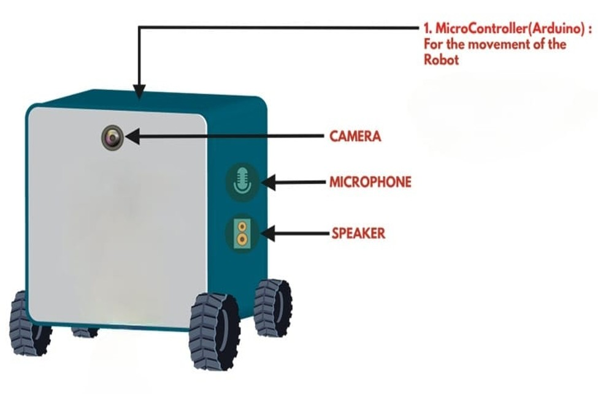
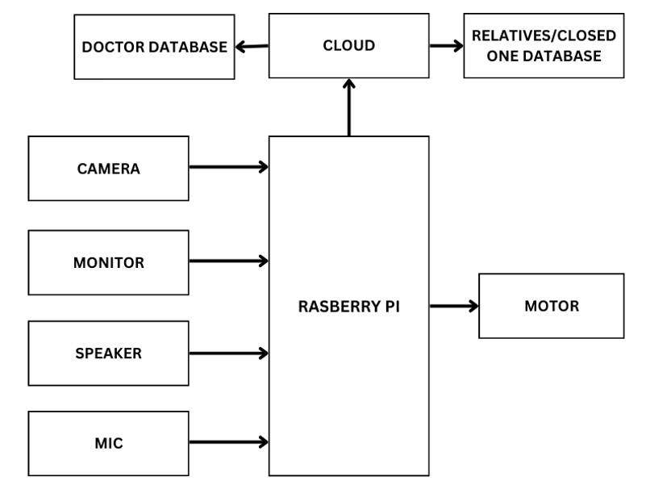
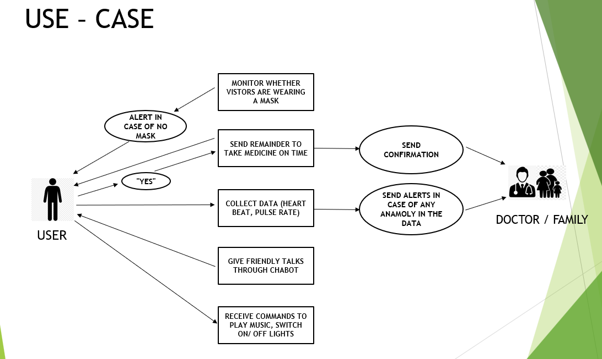
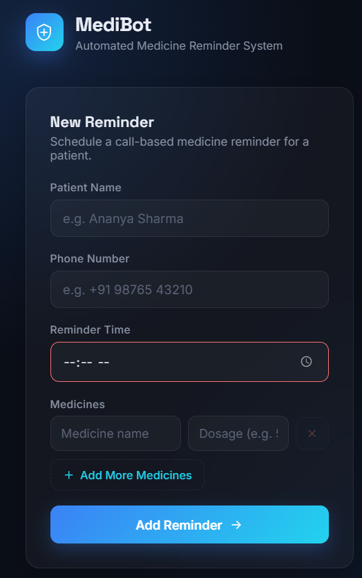
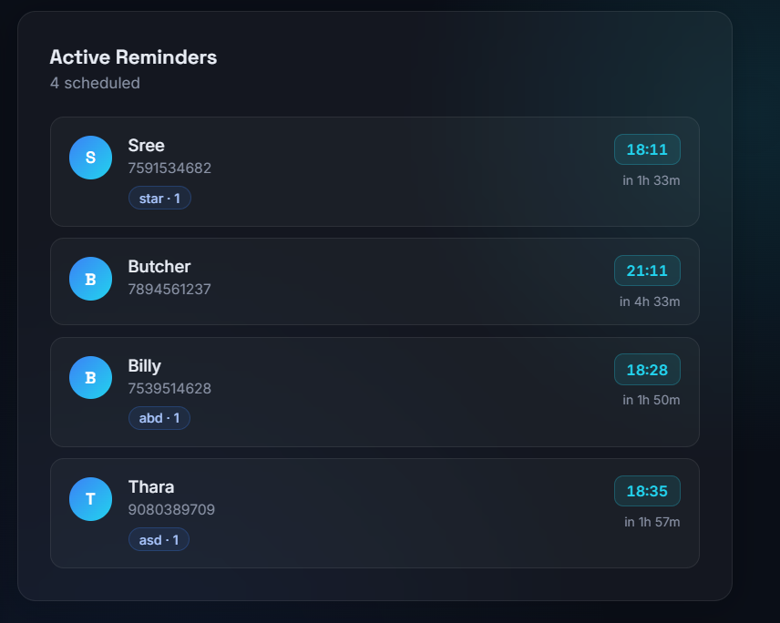
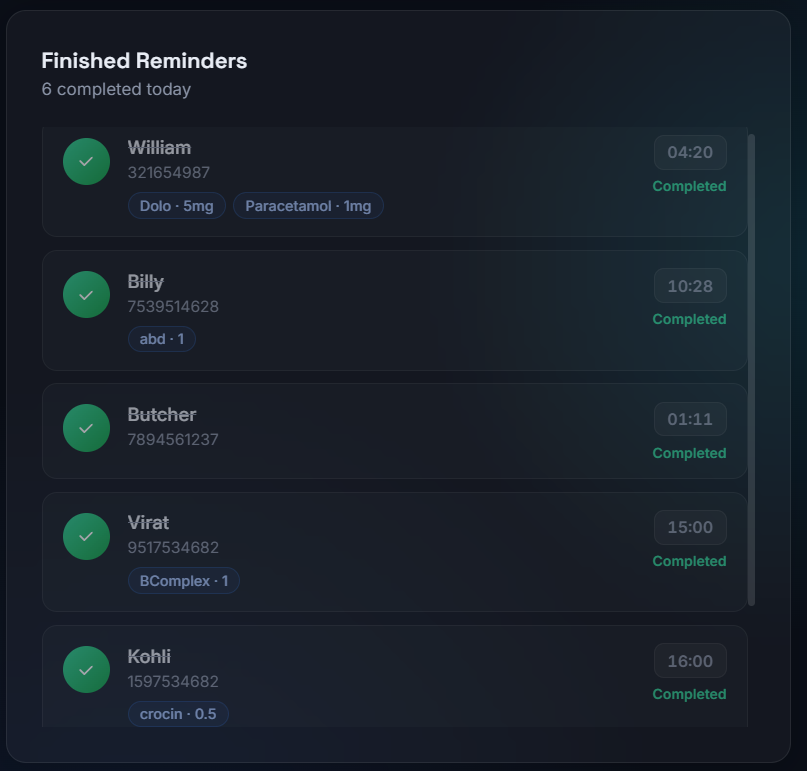
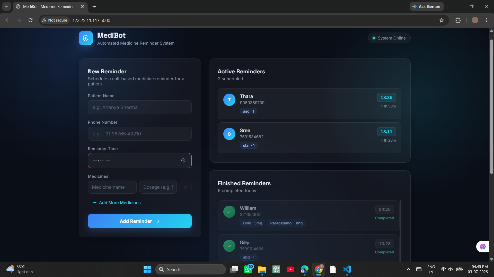

# MediBot — Medicine Reminder Bot

A Flask-based medicine reminder system that schedules patient medication times and places a real phone call — via an Android device — when a dose is due.

## Project Overview

Missed medication doses are a common problem, especially for elderly or forgetful patients. MediBot lets a caregiver register a patient's medicines and reminder time through a simple web dashboard. When the scheduled time arrives, MediBot triggers an automated phone call to the patient's number and speaks an audible alert, so the reminder can't be missed even if the patient isn't looking at a screen.

## Problem Statement

Push notifications and app alarms are easy to ignore or dismiss, and many patients (particularly older adults) don't reliably check reminder apps. A more attention-grabbing, low-friction reminder mechanism is needed.

## Solution

MediBot combines a Flask web server with an Android phone (running SL4A) to place an actual voice call at the scheduled time, plus a text-to-speech alert. Caregivers manage reminders from a browser; the calling device just needs to stay reachable.

## Features

- Add medicine reminders (patient name, phone number, time, medicine list with dosages) through a web form
- Store reminders in a local JSON file — no external database required
- Automatically trigger a phone call when a reminder's time is reached
- Text-to-speech alert spoken on the Android device before the call is placed
- Reports call outcome (answered / rejected) back to the server
- Live dashboard split into "Active" and "Finished" reminders with countdowns

## Software Used

See [software/software_used.md](software/software_used.md) for the full list. In short: Python, Flask, Requests, Jinja2, HTML/CSS/JS, and SL4A's `androidhelper` module.

## System Architecture

```
┌────────────────┐        HTTP         ┌───────────────────┐
│  Browser (UI)   │ ───────────────────▶ │   server/app.py     │
│  templates/     │ ◀─────────────────── │   Flask Server       │
│  static/        │      JSON data       │   data/data.json     │
└────────────────┘                       └─────────┬──────────┘
                                                     │ /make_call?phone=...
                                                     ▼
                                          ┌───────────────────┐
                                          │  Android Device      │
                                          │  android/call_reminder.py │
                                          │  (SL4A androidhelper) │
                                          └─────────┬──────────┘
                                                     │ /call_status
                                                     ▼
                                          back to Flask Server
```

## Working Principle

1. A caregiver submits a reminder (name, phone, time, medicines) through the web dashboard.
2. `server/app.py` stores it in `server/data/data.json`.
3. When the reminder's scheduled time is reached, `/trigger_calls` calls the Android device's `/make_call` endpoint.
4. `android/call_reminder.py`, running on the Android device via SL4A, speaks a TTS alert and places the phone call.
5. Once the call ends, the Android device reports whether it was answered or rejected back to the Flask server via `/call_status`.

## Workflow

Add Reminder → Stored in JSON → Time Reached → Call Triggered → TTS Alert + Phone Call → Call Status Reported → Dashboard Updated

## Hardware Components

See [hardware/hardware.md](hardware/hardware.md) for the full parts list.

## Project Images

| Prototype | Block Diagram |
|---|---|
|  |  |

| Workflow | Circuit Diagram |
|---|---|
|  |  |

## Demo Video

| New Reminder Form | Active Reminders |
|---|---|
|  |  |

| Finished Reminders | Full Dashboard |
|---|---|
|  |  |

## Applications

- Medication adherence reminders for elderly or forgetful patients
- Caregiver/family monitoring of a patient's dosing schedule
- Clinics or care homes managing reminders for multiple patients

## Future Scope

- Support multiple caregiver-configurable devices/phone numbers per patient
- Add SMS as a fallback if a call goes unanswered
- Persist data in a proper database instead of a flat JSON file
- Add authentication so the dashboard isn't open to anyone on the network

## Authors

- tharani165

## License

Not yet chosen.

## Project Structure

```text
MediBot---Medicine-Reminder-Bot/
├── README.md
├── .gitignore
├── docs/
├── images/
├── demo/
├── software/
│   └── software_used.md
├── hardware/
│   └── hardware.md
├── server/                 # Runs on the PC/server hosting the dashboard
│   ├── app.py              # Flask server: web UI + reminder API
│   ├── static/
│   ├── templates/
│   ├── data/
│   └── requirements.txt
└── android/                # Runs on the Android device via SL4A
    └── call_reminder.py
```

## Setup

1. Install dependencies:
   ```bash
   pip install -r server/requirements.txt
   ```
2. Run the Flask app:
   ```bash
   python server/app.py
   ```
3. Open your browser at:
   ```text
   http://127.0.0.1:5000/
   ```
4. Copy `android/call_reminder.py` onto the Android device and run it under SL4A to enable the reminder calls.

## Notes

- The Android-specific reminder endpoint is kept in [android/call_reminder.py](android/call_reminder.py).
- Keep sensitive values such as phone numbers and server addresses in environment variables when deploying.
